#### Table of Contents
1. [Math/Stats](#math/stats)
2. [Coding and Environment](#coding-and-environment)
3. [Machine Learning](#machine-learning)
4. [Model Selection and Evaluation](#model-selection-and-evaluation)
5. [Data Products](#data-products)

---
# Math/Stats

* [Galvanize Short Course for Stats](https://galvanizeopensource.github.io/stats-shortcourse/)
* [PDF Book: Computer Age Statistical Inference Book](https://web.stanford.edu/~hastie/CASI_files/PDF/casi.pdf)

#### Calculus

* [Derivative Rules](https://en.wikipedia.org/wiki/Differentiation_rules)

#### Linear Algebra

* [Wiki](https://en.wikipedia.org/wiki/Linear_algebra)
* [MIT Course](https://ocw.mit.edu/courses/mathematics/18-02-multivariable-calculus-fall-2007/)

#### Probability & Distributions

* [Distribution Applets](https://homepage.divms.uiowa.edu/~mbognar/)
* [Cheatsheet](https://static1.squarespace.com/static/54bf3241e4b0f0d81bf7ff36/t/55e9494fe4b011aed10e48e5/1441352015658/probability_cheatsheet.pdf)
* [Scipy Stats Functions](https://docs.scipy.org/doc/scipy/reference/stats.html)
* [Scipy Stats](https://stackoverflow.com/questions/37559470/what-do-all-the-distributions-available-in-scipy-stats-look-like#37559471)
* [Scipy Cheatsheet](https://onedrive.live.com/?authkey=%21APW6U3IpfyxCXmY&cid=233807F4EE406C1F&id=233807F4EE406C1F%215688&parId=233807F4EE406C1F%215605&o=OneUp)


thing | Discrete | Continuous | R
------|----------|----------| ---
Density at a point | pmf | pdf | d
area to left of point | cdf  | cdf | p
point where area to left equal prob | ppf | ppf | q

Discrete, area to left (```st.binom.cdf(2, 6, .2)```)

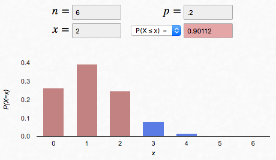

Discrete, at a point (```st.binom.pmf(2, 6, .2)```)

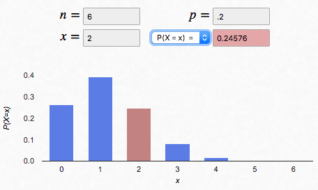

Continuous, area to left (```st.norm.cdf(6, 5.7, .5)```)

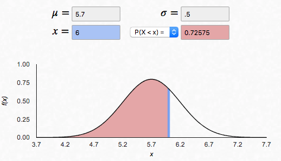


```python
## Plot Continuous Distribution
def plot_continuous(dist):
    fig, ax = plt.subplots(2, 1, sharex=True, figsize=(4, 5))
      # Plot hist
    rvs = dist.rvs(size=1000)
    ax[0].hist(rvs, density=True, alpha=0.2, histtype='stepfilled')
    x=np.linspace(dist.ppf(0.01), dist.ppf(0.99), 50)
    ax[0].plot(x, dist.pdf(x), '-', lw=2)
    ax[0].set_title( dist.dist.name.title() + ' PDF')
    ax[0].set_ylabel('p(X=x)')
      # Plot cdf.
    ax[1].plot(x, dist.cdf(x), '-', lw=2)
    ax[1].set_title( dist.dist.name.title() + ' CDF')
    ax[1].set_ylabel('p(X<=x)')
    ax[1].set_xlabel('x')
    return (fig, ax)

## And then call it like
## import scipy.stats as st
lam = 1  # lambda
exponential = st.expon(scale=1/lam)
plot_continuous(exponential);
```

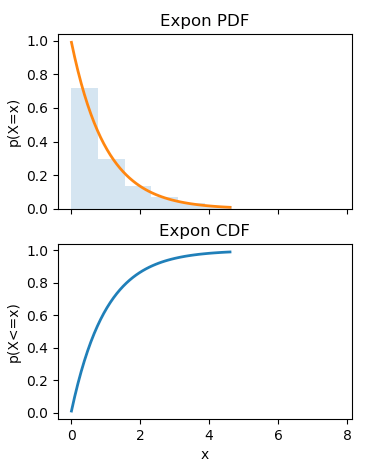

```python
# Plot Discrete Distribution
def plot_discrete(dist):
    fig, ax = plt.subplots(2, 1, sharex=True, figsize=(4, 5))
     # Plot hist
    rvs = dist.rvs(size=1000)
    w = np.ones_like(rvs)/ float(len(rvs))
    ax[0].hist(rvs, weights=w, alpha=0.2, histtype='stepfilled')
      # Plot pmf.
    k = np.arange(dist.ppf(0.01), dist.ppf(0.99)+1)
    ax[0].plot(k, dist.pmf(k), 'bo', lw=2);
    ax[0].set_title( dist.dist.name.title() + ' PMF')
    ax[0].set_ylabel('p(X=k)')
     # Plot cdf.
    ax[1].plot(k, dist.cdf(k), 'bo', lw=2);
    ax[1].set_title( dist.dist.name.title() + ' CDF')
    ax[1].set_ylabel('p(X<=k)')
    ax[1].set_xlabel('k');
    return (fig, ax)

## And then call it with
## import scipy.stats as st
binomial=st.binom(n=6,p=0.2)
plot_discrete(binomial);
```

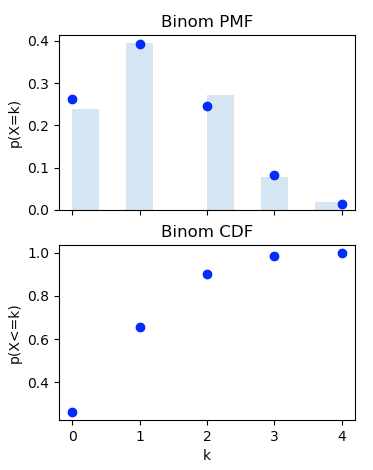

#### Bootstrap

*The bootstrap takes 200-2000 samples of length equal to sample, and calculates the statistic of interest. This process creates a distribution for the statistic and can be used to create confidence intervals for many statistics including means, standard deviations, and beta coefficients. It is computationally expensive, but is more versatile that MLE.*

* use `np.percentile(array, [2.5,97.5])`
* bootstrap
```python
## INPUT: np array
## OUTPUT - bootstrap confidence intervals
def bootstrap_ci(lst, bootstraps=1000, ci=95):
    n = len(lst)
    bootstraps_list = ([np.mean([lst[np.random.randint(n)] for i in np.arange(n)]) for i in np.arange(bootstraps)])
    conf_int = np.percentile(bootstraps_list, [(100-ci)/2,100-((100-ci)/2)])
    return print('The {} conf_int for the sample is {}.'.format(ci, conf_int))
```

#### Maximum Likelihood Estimation

* [Maximum Liklihood Estimation MIT](https://ocw.mit.edu/courses/mathematics/18-05-introduction-to-probability-and-statistics-spring-2014/readings/MIT18_05S14_Reading10b.pdf)
* [Maximum Likelihood Estimation Stanford](http://statweb.stanford.edu/~susan/courses/s200/lectures/lect11.pdf)

#### Experimental Design & Hypothesis Testing

* [Sampling](https://en.wikipedia.org/wiki/Sampling_(statistics))
* [Power](https://en.wikipedia.org/wiki/Statistical_power#Factors_influencing_power) - `Pr(Reject H0 | H1 is true)`
* [ANOVA vs T-test](https://keydifferences.com/difference-between-t-test-and-anova.html)
* [Scipy Stats hypothesis test, scroll to bottom](https://docs.scipy.org/doc/scipy/reference/stats.html)
* [Airbnb Post - experimental design](https://medium.com/airbnb-engineering/experiments-at-airbnb-e2db3abf39e7)

#### Power

*Statistical power is the probability that a statistical test will correctly reject a false null hypothesis.*

* [Power great visualization](http://my.ilstu.edu/~wjschne/138/Psychology138Lab14.html)
* [Quick-R Power](https://www.statmethods.net/stats/power.html)
* Breusch-Pagan - tests for Heteroscedasticity
* Shaprio-Wilk - tests for normality of residuals


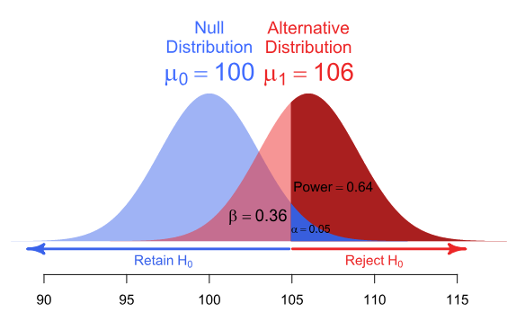


```python
# A/B Test of two sample proportions (e.g. sign up rate on website)
from z_test import z_test
z_test.z_test(mean1, mean2, n1, n2, effect_size=.01,two_tailed=False)
```

```python
## Kolmogorov-Smirnov
## null hypothesis is that both come from same distribution
import scipy.stats as st
randpois = st.poisson(6, 1).rvs(100)
st.ks_2samp(randpois, my_dist)
```

```python
## You randomly select 50 dogs and 80 cats from a large animal shelter, and want to know if dogs and cats have the same weight.
dogs = st.norm.rvs(loc=28, scale=3, size=50)
cats = st.norm.rvs(loc=27.5, scale=1 , size=80)
st.ttest_ind(dogs, cats, equal_var=False)
```

#### Covariance

**Covariance** is a summary statistic that measures how much two variables vary together. For example,
the covariance is positive when high values of X co-occur frequently with high values of Y.
The covariance is negative when high values of X co-occur frequently with low values of Y.
The covariance is zero when the values of X co-occur randomly with values of Y.
Similar to correlation, covariance measures the strength of the linear relationship (though it is unscaled).

#### Conditional probability

P(A and B) = P(A) * P(B|A)


#### Joint Probability Mass Functions (Discrete Vars)

The **joint PMF** of two discrete random variables X and Y describes how much the probability mass is
placed on each possible pair of values (x, y).

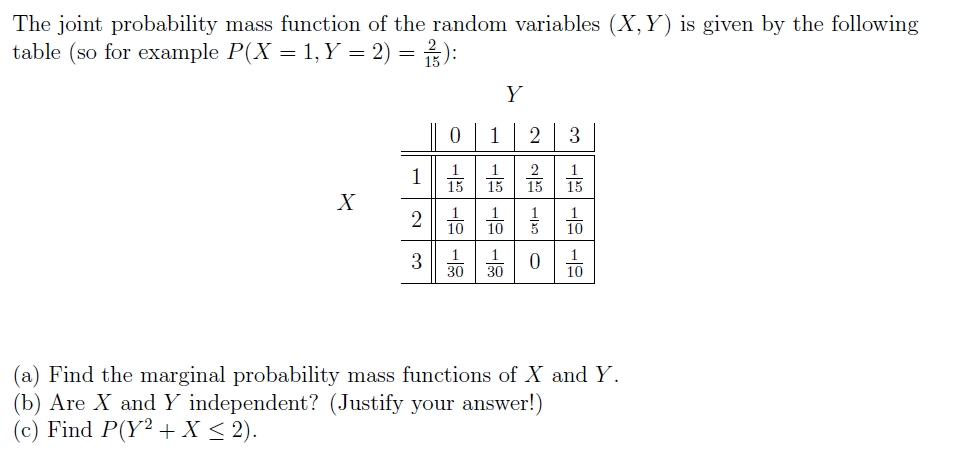

#### Joint Probability Density Functions (Continuous Vars)

Similarly, the **joint PDF** of two continuous random variables X and Y describes the relatively likelihood
placed on the pair of possible values (x, y). The idea is similar to the discrete case, but as the values are
continuous, it makes more sense to think of the continuous rv's as falling into a two-dimensional set (such as a
rectangle) obtained through integration.

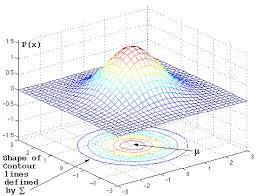

#### One Sample T-test

*Calculate the T-test for the mean of ONE group of scores*

```python
import scipy.stats as st
rvs = st.norm.rvs(loc=5, scale=10, size=50)

st.ttest_1samp(rvs,5.0)
```

#### Two sample, difference in Means

*Calculates the T-test for the means of two independent samples of scores*

```python
import scipy.stats as st
rvs1 = stats.norm.rvs(loc=6,scale=10,size=500)
rvs2 = stats.norm.rvs(loc=5,scale=10,size=500)
stats.ttest_ind(rvs1,rvs2)
```

#### Pearson and Spearman Correlations

The Pearson correlation you have encountered in `Part 2` evaluates the linear relationship between two continuous
variables. The Spearman correlation evaluates the monotonic relationship between two continuous or ordinal variables
without assuming linearity of the variables. Spearman correlation is often more robust in capturing non-linear relationship
between variables.

#### Chi-squared hypothesis test

*Used to determine whether there is a significant difference between the expected frequencies and the observed frequencies in one or more categories.*

```python
st.chisquare([16, 18, 16, 14, 12, 12], f_exp=[16, 16, 16, 16, 16, 8])
```
[Chi-square pdf](http://onlinestatbook.com/2/chi_square/chi_square.pdf)

#### Bonferonni

*divides the p-value (level of evidence needed) over each test such. Thus, we require a higher level of evidence in each individual test. Very conservative.*

#### False Discovery Rate (FDR)

*The false discovery rate is a different type of correction than family-wise correction. Instead of controlling for the risk of any tests falsely being declared significant under the null hypothesis, FDR will control the number of tests falsely declared significant as a proportion of the number of all tests declared significant.*

[FDR explanation](https://matthew-brett.github.io/teaching/fdr.html)

#### Bayesian Methods

PyMC3 is a package for incorporating bayesian methods in python

[PyMC3](http://docs.pymc.io/notebooks/getting_started.html)
```Python
from pymc3 import Normal, Model, DensityDist, sample
from pymc3.math import log, exp
from pymc3 import df_summary

with Model() as disaster_model:
    switchpoint = DiscreteUniform('switchpoint', lower=0, upper=n_years)
```

PyMC3 switchpoint
```python
from pymc3.math import switch

with disaster_model:

    rate = switch(switchpoint >= np.arange(n_years), early_mean, late_mean)
```

Changepoint, Switchpoint analysis
```python
import scipy.stats as st
import numpy as np
import pymc3 as pm
import theano.tensor as tt
import matplotlib.pyplot as plt
%matplotlib inline

## Draw two random variables from Poisson
pois1 = st.poisson.rvs(5, size=100)
pois2 = st.poisson.rvs(6.5, size=100)
newlist = np.append(pois1, pois2)
n_newlist = len(newlist)

## assign lambdas and tau to stochastic variables
with pm.Model() as model:
    alpha = 1.0/newlist.mean()  # Recall count_data is the
                                   # variable that holds our txt counts
    lambda_1 = pm.Exponential("lambda_1", alpha)
    lambda_2 = pm.Exponential("lambda_2", alpha)
    tau = pm.DiscreteUniform("tau", lower=0, upper=n_newlist)

## create a combined function for lambda (it is still a RV)    
with model:
    idx = np.arange(n_newlist) # Index
    lambda_ = pm.math.switch(tau >= idx, lambda_1, lambda_2)

## combine the data with our proposed data generation scheme    
with model:
    observation = pm.Poisson("obs", lambda_, observed=newlist)

## inference
with model:
    step = pm.Metropolis()
    trace = pm.sample(1000, tune=5000,step=step)


    fig = plt.figure(figsize=(12.5,5))
    ax = fig.add_subplot(111)

    N = tau_samples.shape[0]
    expected_texts_per_day = np.zeros(n_newlist)
    for day in range(0, n_newlist):
        ix = day < tau_samples
        expected_texts_per_day[day] = (lambda_1_samples[ix].sum()
                                       + lambda_2_samples[~ix].sum()) / N

    ax.plot(range(n_newlist), expected_texts_per_day, lw=4, color="#E24A33",
             label="expected number of referrals")
    ax.set_xlim(0, n_newlist)
    ax.set_xlabel("Day")
    ax.set_ylabel("Expected # referrals")
    ax.set_title("Expected number of referrals")
    ax.bar(np.arange(len(newlist)), newlist, color="#348ABD", alpha=0.65,label="observed referrals per day")
    ax.legend(loc="upper left");
```

[MIT Bayesian Inference with Discrete Priors](https://ocw.mit.edu/courses/mathematics/18-05-introduction-to-probability-and-statistics-spring-2014/readings/MIT18_05S14_Reading11.pdf)


#### Permutations

*Count without replacement, order matters. "Arrangements"*

A museum has 7 painting by Picasso and wants to arrange 3 of them on the same wall. How many ways?

```python
import math
def get_permutations(total, choose):
    return math.factorial(total)/math.factorial(total-choose)
```

How many ways can you arrange the letters in the word LOLLIPOP?

N = 8, L = 3, O = 2, I = 1, P = 2

8! / 3!2!2! = 8*7*6*5 = 1680

#### Combinations

*Counting without replacement, and order does NOT matter*

A person playing poker is dealt 5 cards. How many different hands could the player have been dealt?


#### Math_Stats Miscellaneous

* [Book: Probabilistic Programming](http://nbviewer.jupyter.org/github/CamDavidsonPilon/Probabilistic-Programming-and-Bayesian-Methods-for-Hackers/tree/master/)
* [Maximum A Posteriori](https://web.stanford.edu/class/archive/cs/cs109/cs109.1166/ppt/22-MAP.pdf)
* Correlation is just scaled Covariance - scaled by the product of standard variations of each variable.
___

# Coding and Environments

#### Docker[.](https://hub.docker.com/)

*Containerize code to make it easier to share with others.  A docker container contains all code and packages needed to run it.*

* Docker Client - build images, run images, stop containers
* Docker Host -

```shell
# Use an official Python runtime as a parent image
FROM python:2.7-slim

# Set the working directory to /app
WORKDIR /app

# Copy the current directory contents into the container at /app
ADD . /app

# Install any needed packages specified in requirements.txt
RUN pip install --trusted-host pypi.python.org -r requirements.txt

# Make port 80 available to the world outside this container
EXPOSE 80

# Define environment variable
ENV NAME World

# Run app.py when the container launches
CMD ["python", "app.py"]
```

#### Flask

GET
POST
HTML
CSS -

Ports 1-1024 are reserved, but others are open for use. Tovio uses 4000-9000 typically.

#### Bootstrap

Standards CSS and applying it to content.  Must put on right folder so flask can find and serve it.

#### Bokeh


#### GitHub

* [Github Explained](https://www.ifi.uzh.ch/dam/jcr:ff780599-d5e2-4d05-b923-1c333cbf2842/A%20Tutorial%20for%20GitHub.pdf)
* [Interactive Tool](http://ndpsoftware.com/git-cheatsheet/previous/git-cheatsheet.html)
* [Adding a Github repo to house local project](https://help.github.com/articles/adding-an-existing-project-to-github-using-the-command-line/)
* Check origin: `git remote -v`

#### Pair Workflow
```
* A:
  * needs to add B as a collaborator for that repo on his/her Github.
  * adds a branch, e.g. `$ git checkout -b pair_morning`
  * starts coding (B navigating and helping)
  * Add, commit, push the branch to Github when it’s B’s turn to code.
    * e.g. `$ git push origin pair_morning`
* B:
  * After A adds B as collaborator, adds A’s repo as a remote:
    * `$ git remote add <partner-name> <partner-remote-url>`
  * Help A!
  * When B’s turn to code comes:
    * `$ git fetch <partner-name>`
    * `$ git checkout --track <partner-name>/<branch-name>`
  * Starts coding (A navigating and helping)
  * When A’s turn comes again:
    * `$ git push <partner-name> <branch-name>`

**Switching**
* A:
  * `$ git checkout <branch-name>`
  * `$ git pull <remote-name> <branch-name>`
  * A works on code (B collaborating). ABC!
  *  `$ git push <remote-name> <branch-name>`
* B:
  * `$ git checkout <branch-name>`
  * `$ git pull <remote-name> <branch-name>`
  * B works on code (A collaborating). ABC!
  * `$ git push <remote-name> <branch-name>`
```


#### SQL

* [SQL for Data Scientists](http://downloads.bensresearch.com/SQL.pdf)
* [ModeAnalytics: SQL School](http://sqlschool.modeanalytics.com/)
* [7 Handy SQL features for Data Scientists](http://blog.yhathq.com/posts/sql-for-data-scientists.html)
* [Postgres Docs](https://www.postgresql.org/docs/)
* [Postgres Guide](http://postgresguide.com/)
* [Statistics in SQL](https://github.com/tlevine/sql-statistics)
* [Intro to SQL](http://bensresearch.com/downloads/SQL.pdf)


```shell
#Create a database
`CREATE DATABASE readychef;`
#load data into empty database
`$ psql readychef < readychef.sql`
#Navigate to a db
`psql db`
```

Order
`SELECT FROM JOIN ON WHERE GROUPBY HAVING ORDERBY LIMIT`

Order of evaluation
`FROM WHERE GROUPBY HAVING SELECT DISTINCE ORDERBY`


#### Anaconda and Jupyter notebooks

```shell
## Do this each week to stay up-to-date
conda update conda
conda update --all
```

#### Python

* [Style Guide](https://www.python.org/dev/peps/pep-0008/)
* [Pythonic Code](http://docs.python-guide.org/en/latest/writing/style/)
* Create a Python 2 environment `conda create -n py2 python=2 anaconda`
* [Classes and Objects Youtube Videos](https://www.youtube.com/watch?v=ZDa-Z5JzLYM&list=PL-osiE80TeTt2d9bfVyTiXJA-UTHn6WwU&index=37)

```Python
## stuff you want to run no matter what
## whether directly or from an import
## typically functions

if __name__ == '__main__':
  ## stuff you want to run only if running the file directly
```
[Article: What does ```if __name__ == '__main__':``` do? ](https://stackoverflow.com/questions/419163/what-does-if-name-main-do)

```python
## create Categorical Var from Continuous Var
df['new_categ_var'] = pd.cut(df['continuous_var'], [3, 6, 10], labels=['<3','4-6','7-10'])
```
```python
## Use for understanding coding errors
import pdb
pdb.set_trace()
```

```python
## Python Starter
import pandas as pd
import numpy as np
import seaborn as sns
import matplotlib.pyplot as plt
# import warnings; warnings.simplefilter('ignore')
pd.set_option("display.max_columns", 100)
pd.set_option('display.max_rows', 500)
%matplotlib inline
```

```python
## Python Starter Cleaning
from sklearn.preprocessing import StandardScaler, OneHotEncoder
from sklearn.pipeline import Pipeline
from regression_tools.dftransformers import (
    ColumnSelector, Identity, FeatureUnion, MapFeature, Intercept)
```

```python
## Python Starter Fitting
from sklearn.model_selection import train_test_split, KFold, cross_val_score
```

A Python Class

```python
class ItemItemRecommender(object):
    """Item-item similarity recommender."""

    def __init__(self, neighborhood_size=5):
        """Initialize the parameters of the model."""
        self.neighborhood_size = neighborhood_size
        self.neighborhood = None
        self.items_cos_sim = None
        self.user_preds = None

    def fit(self, ratings_mat):
        """Fit the model to the data specified as an argument.

        Store objects for describing model fit as class attributes.
        """
        self.items_cos_sim = cosine_similarity(ratings_mat.T)
        least_to_most_sim_indexes = np.argsort(self.items_cos_sim, 1)
        self._set_neighborhoods(least_to_most_sim_indexes)


    def _set_neighborhoods(self, least_to_most_sim_indexes):
        """Get the items most similar to each other item.

        Should set a class attribute with a matrix with number of rows
        equal to number of items, and number of columns equal to
        neighborhood size. Entries in this matrix will be indices of other
        items.

        You will call this in your fit method.
        """
        self.neighborhood = least_to_most_sim_indexes[:, -(self.neighborhood_size+1):][:,0:self.neighborhood_size]


    def pred_one_user(self, ratings_mat, user_id):
        """Accept user id as arg. Return the predictions for a single user.

        Optional argument to specify whether or not timing should be
        provided on this operation.
        """
        n_items = ratings_mat.shape[1]
        items_rated_by_this_user = ratings_mat[user_id].nonzero()[1]

        output = np.zeros(n_items)
        for item_to_rate in range(n_items):
            relevant_items = np.intersect1d(self.neighborhood[item_to_rate],
                                            items_rated_by_this_user,
                                            assume_unique=True)
                                        # assume_unique speeds up intersection op
            # note: ratings_mat has data type `sparse_lil_matrix`, while
            # items_cos_sim is a numpy array. Luckily for us, multiplication
            # between these two classes is defined, and even more luckily,
            # it is defined to as the dot product. So the numerator
            # in the following expression is an array of a single float
            # (not an array of elementwise products as you would expect
            #  if both things were numpy arrays)
            output[item_to_rate] = (ratings_mat[user_id, relevant_items]*
            self.items_cos_sim[item_to_rate, relevant_items])/(self.items_cos_sim[item_to_rate, relevant_items]).sum()
        output = np.nan_to_num(output)
        return output

    def pred_all_users(self, ratings_mat):
        """Return a matrix of predictions for all users.

        Repeated calls of pred_one_user, are combined into a single matrix.
        Return value is matrix of users (rows) items (columns) and
        predicted ratings (values).

        Optional argument to specify whether or not timing should be
        provided on this operation.
        """
        user_preds = np.zeros(ratings_mat.shape)
        for user in np.arange(ratings_mat.shape[0]):
            user_preds[user,:] = pred_one_user(user, ratings_mat)
        self.user_preds = user_preds
        return user_preds


    def top_n_recs(self, user_id, ratings_mat, n=4):
        pred_ratings = self.pred_one_user(ratings_mat, user_id)
        item_index_sorted_by_pred_rating = list(np.argsort(pred_ratings))
        items_rated_by_this_user = ratings_mat[user_id].nonzero()[1]
        unrated_items_by_pred_rating = [item for item in item_index_sorted_by_pred_rating
                                        if item not in items_rated_by_this_user]
        return unrated_items_by_pred_rating[-n:]


if __name__ == '__main__':
    IIR = ItemItemRecommender(neighborhood_size=4)
    ratings_mat = sparse.lil_matrix(np.array([[4, 0, 0, 5, 1, 0, 0],
                                          [5, 5, 4, 0, 0, 0, 0],
                                          [0, 0, 0, 2, 4, 5, 0],
                                          [0, 3, 0, 0, 0, 0, 3]]))
    IIR.fit(ratings_mat)
    print(IIR.neighborhood)
    print(IIR.items_cos_sim)
    print(IIR.pred_one_user(ratings_mat, user_id=2))

    print(IIR.top_n_recs(user_id=2, ratings_mat=ratings_mat, n=3))
```


#### psycopg (Python to PostgreSQL)

Cursor operations typically goes like the following:
* execute a query
* fetch rows from query result if it is a SELECT query because it is iterative, previously fetched rows can only be fetched again by rerunning the query
* close cursor through .close()

[Browse Psycopg documentation](http://initd.org/psycopg/docs/)

```python
import psycopg2
from datetime import datetime
conn = psycopg2.connect(dbname='socialmedia', user='postgres', host='/tmp')
c = conn.cursor()
today = '2014-08-14'
# This is not strictly necessary but demonstrates how you can convert a date
# to another format
ts = datetime.strptime(today, '%Y-%m-%d').strftime("%Y%m%d")
c.execute(
    '''CREATE TABLE logins_7d AS
    SELECT userid, COUNT(*) AS cnt, timestamp %(ts)s AS date_7d
    FROM logins
    WHERE logins.tmstmp > timestamp %(ts)s - interval '7 days'
    GROUP BY userid;''', {'ts': ts}
)
conn.commit()
conn.close()
```

#### Mongodb

*An element of data is called a document, and documents are stored in collections. One collection may have any number of documents.*

* [SQL to Mongodb translator](https://docs.mongodb.com/manual/reference/sql-aggregation-comparison/)

#### Pymongo (Python to Mongodb)

* [Cheat sheet](https://gist.github.com/stevemclaugh/530979cddbc458d25e37c9d4703c13f6)

```python
from pymongo import MongoClient
from pprint import pprint
from nltk.tokenize import word_tokenize
from nltk.corpus import stopwords

client = MongoClient()
## Suppose we have a database called nyt_dump
db = client.nyt_dump
## find collections in nyt_dump
db.collection_names()

## create an object of the collection "articles"
coll = db.articles
coll.find_one()


```

#### Unit Testing

`unittest` is a package that you use when you're doing unit testing.  You write the code, then the test code in a separate file. In the test code, one of the files that you load is the actual code that you're testing

`python -m unittest test.unit_test_sample`

run a test `make test`

```python
import unittest
from primes import is_prime

class PrimesTestCase(unittest.TestCase):
    """Tests for `primes.py`."""

    def test_is_five_prime(self):
        """Is five successfully determined to be prime?"""
        self.assertTrue(is_prime(5))

if __name__ == '__main__':
```

* [Tutorial](https://jeffknupp.com/blog/2013/12/09/improve-your-python-understanding-unit-testing/)


#### Python to R, R to Python

In a python script, you can write ".R" files and then run them, all while still in Python.  Use code:
```Python
%%writefile getmtcars.R
a = mtcars
write.csv(a, 'cars.csv')
```
```python
 !Rscript getmtcars.R
```

RPy2


#### Keras [.](https://keras.io/)

*Keras is a high-level neural networks API, written in Python and capable of running on top of TensorFlow, CNTK, or Theano. It was developed with a focus on enabling fast experimentation. Being able to go from idea to result with the least possible delay is key to doing good research.*

#### Theano [.](https://github.com/Theano/Theano)

*Theano is a Python library that allows you to define, optimize, and evaluate mathematical expressions involving multi-dimensional arrays efficiently. It can use GPUs and perform efficient symbolic differentiation.*


#### Cron

[crontab.guru](https://crontab.guru/)

#### Apache Airflow [.](https://airflow.apache.org/plugins.html)

*cron on steroids*

relies on directed acyclic graphs


#### AWS

* S3 bucket - storage - can access with a url
  * Don't immediately have access to AML, that needs to be granted through a policy
* EC2 - elastic cloud computing
* IAM - Identity Access and Management User
  * Admin - full access
  * ML_User - s3, ml

#### Benefits of Cloud Computing

1. Trade Capital Expense for Variable EXPENSE
2. Benefits from Massive Economies of Scale
3. Stop Guessing about Capacity
4. Increase Speed and Agility
5. Stop spending money running and maintaining centers
6. Go Global in Minutes - can deploy in multiple regions

#### AWS CLI

`aws help`
`less ~/.aws/config`
`less ~/.aws/credentials`
`aws s3 ls`
`aws ec2 describe-instances --output table`

When a process is running, need to ensure it doesn't stop if you close your screen. You can attach to a screen to keep an instance alive.

Once you've launched ec2 instance, you need to configure it with the right packages to run your code. Best practice to get python 3 up first, the install pip.  Then you can run pip to get everything else set up.

[Install Python Pip on EC2](https://docs.aws.amazon.com/elasticbeanstalk/latest/dg/eb-cli3-install-linux.html)

create a s3 bucket
`aws s3 mb s3://my-first-backup-bucket`

Amazon Machine Learning can create simple models with endpoints for applications. You can upload data to S3 buckets, then use the data to train model. AML can host that model and generate an endpoint for very cheap.

#### Boto

*python library that helps you communicate with aws*

```python
import boto

# Connect to S3 - DO NOT JUST DIRECTLY REPLACE THE BELOW WITH YOUR ACCESS
# AND SECRET ACCESS KEY!! This runs the risk of you pushing them
# up to github. Store
# them as environment variables in your .bashrc / .bash_profile and read
# them in from there. See your lecture notes or read_aws_credentials.md for how to do this.

conn = boto.connect_s3()

### If the above fails to authenticate, either create a file in ~/.aws with your credentials as
### described in read_aws_credentials.md, or use on of the other methods to load them from a file
### and use the code below
#access_key, access_secret_key = 'YOUR ACCESS KEY', 'YOUR SECRET ACCESS KEY'
#conn = boto.connect_s3(access_key, access_secret_key)


# List all the buckets
all_buckets = [b.name for b in conn.get_all_buckets()]
print all_buckets

# Check if bucket exist. If exist get bucket, else create one
bucket_name = 'tysonjens-chancho-is-my-first-name'

if conn.lookup(bucket_name) is None:
    b = conn.create_bucket(bucket_name)
else:
    b = conn.get_bucket(bucket_name)

# Print all the files in the bucket
filenames = [f.name for f in b.list()]
print filenames

# Add files to bucket:
b = conn.get_bucket('garrett-dsi-ind')

fnames = ['cancer_rate.png','cancer_rates.csv']
files = ['/img/cancer_rate.png','cancer_rates.csv']
for i in [0,1]:
    file_object = b.new_key(fnames[i])
    file_object.set_contents_from_filename(files[i])

# Delete a file
a = b.new_key('somefilename')
a.delete()

# Delete Bucket
# Must delete all files in bucket
# Before deleting bucket
for key in b.get_all_keys():
    key.delete()
conn.delete_bucket(bucket_name)
```

#### EC2

*Elastic Cloud Compute* - an aws machine, called and instance, that is made for computing (not storage like S3). There are many different kinds, sizes, built for different purposes.

[Create a Spark Cluster](https://github.com/tysonjens/dsi-spark-aws/blob/master/pair_part1.md)

[Chris Albon EC2 Toot](https://chrisalbon.com/software_engineering/cloud_computing/run_project_jupyter_on_amazon_ec2/)

#### Apache Spark

Elliot's guide to [frictionless cloud computing](https://github.com/gSchool/dsi-high-performance-python/blob/elliot/workflow_recommendation.md)  *How to add your credentials to an ec2 so you can do everything you need to from there*

Works with Scala, Java, Python, R
Datasources: hadoop, cassandra, hive, hbase, postgresql, csv, json, mysql

main abstraction for spark is the RDD - *resilient distributed dataset*

The Apache Spark platform works with Spark SQL, Spark Streaming, ML, and GraphX.  Good becasue it's hard to get things out of spark.


|             |                 Spark                |                           Hadoop                          |
|:-----------:|:------------------------------------:|:---------------------------------------------------------:|
|  Filesystem |                  Any                 |                         HDFS only                         |
|    Speed    | Much faster, but uses lots of memory | writes things to local after each step, slows things down |
| Reliability |   Getting better, but a little bug   |                 Very reliable because OLD                 |


Spark attaches to 0.0.0.0:4040/jobs/, but check 4041, 4042 etc. if not there.

We use `pyspark`

from command line `pyspark`

*What is Big Data?* Data so large it cannot be stored on one machine, and cannot be processed on one machine.

```python
## Switch between python dataframe and spark dataframe
from pyspark.sql import SparkSession

# Setup a SparkSession
spark = SparkSession.builder.getOrCreate()

...

# Convert a Pandas DF to a Spark DF
spark_df = spark.createDataFrame(pandas_df)

# Convert a Spark DF to a Pandas DF
pandas_df = spark_df.toPandas()
```

```python
import pyspark as ps
spark = ps.sql.SparkSession.builder.getOrCreate()
```

Spark uses lazy evaluation, meaning transformations aren't performed until an action is taken. So long as syntax of a transformation looks ok, you won't see an error, but this doesn't mean it will work with data flowing through.

Apache Spark has unique syntax - check out: /galvanize/3_coding_environs/dsi-spark/spark-intro/spark-intro.ipynb

#### Scala

from command line `spark-shell`


#### Spark SQL

* [Built in Functions](https://spark.apache.org/docs/latest/api/sql/)

RDD with a schema

Schema = Table Names + Column Names + Column Types

```python
from pyspark.sql import SQLContext
sqlContext = SQLContext(sc)
```

You can load a json file into a spark SQL dataframe, and it will automatically interpret key:value pairs as columns.  

```python
ssdf = sqlContext.read.json("customerData.json")
ssdf.show()  ## shows the dataframe
ssdf.printSchema()
```

You perform SQL queries with a syntax similar to pandas.

```python
ssdf.select('columnname').show()
ssdf.filter(ssdf['columnname'] == 40).show()
ssdf.groupBy('columnname').count().show()
## perform multiple aggregations on different columns
ssdf.groupBy('columnname').agg({'salary': 'avg', 'age': 'max'}).show()

## you can create a dataframe out of the sql context from a list
mylist = [{'name': 'Sales', 'id': '100'}, {'name': 'Engineering', 'id': '200'}]
deptdf = sqlContext.createDataFrame(mylist)
deptdf.show()

## joining
df1.join(df2, df1.unique == df2.unique).show()

## register a data frame as a sql table and run normal sql statements against it
ssdf.registerTempTable('name_of_table')
sqlContext.sql("select * from name_of_table where column > 4000").show()

## convert it to pandas dataframe
empPanda = empDf.toPandas()
```

Create data frames from RDD
```python


## Infer the schema, and register the DAtaFrame as a table  
autoDF = sqlContext.createDataFrame(autoMap)
autoDF.registerTempTable("autos")
sqlContext.sql("select * from autos where hp > 200").show()

```

```python
## how to explode a nested field with "LATERAL VIEW"
result2 = spark.sql(
            '''
            SELECT name, city, state, stars, categories
            FROM yelp_business LATERAL VIEW explode(categories) adTable AS cat
            WHERE stars = 5
            AND city = 'Phoenix'
            AND attributes.`Accepts Credit Cards` = 'true'
            AND cat = 'Restaurants'
            ''')
```

Spark SQL Window Functions - rolling mean, exponentially weighted time series models

#### Spark ML

*replaced MLlib in 2015*
*Basic stats, linear models, decision tree, ensembles, mlp classifier, clustering, dimension reduction etc.*
*inspired by scikit-learn*

```python
## Spark ML Pipeline
tokenizer = RegexTokenizer(inputCol='text', outputCol='tokens', pattern='\\W')
tf = HashingTF(inputCol='tokens', outputCol='features')
lr = LogisticRegression(maxIter=10, regParam=.001)

pipeline = Pipeline(stages=[tokenizer, tf, lr])

model = pipeline.fit(training_df)
```

#### Start a cluster

1. Go to 3_coding_and_environs
2. from Command Line `bash launch_cluster.sh tysonjens-referrals spark 4`. The first arg is the name of an s3 bucket, the second are .pem credentials, the third is the number of instances.
3. Update `atom ~/.ssh/config` - with the instance name
4. scp jupyspark-emr.sh to the master instance of your fucking cluster `scp -i spark jupyspark-emr.sh hadoop@ec2-54-212-242-23.us-west-2.compute.amazonaws.com:~/`
6. From cluster home, go to master's security groups, select master, action--> edit inbound rules. Ensure there is one that has SSH, TCP, 22, Anywhere.  Although we use anywhere, our .pem ensures only we can access.
7. From shell, do  `ssh <keypair>`
8. From the instance's shell, `bash jupyspark-emr.sh`
9. On local, run `ssh -NfL 48888:localhost:48888 <hostnamefrom.ssh/configfile>`
10. The go to http://0.0.0.0:48888/?token=5aa6ebaf6d3b16b4ee734ef8ec098d383b240b798e42610c in your browser
11. Read data from your s3 bucket with something like:

```python
import pyspark
data_df = spark.read.csv('s3://tysonjens-referrals/2017_refs.csv', sep='|')
```

#### Elliot's useful AWS snippets

ssh to running ec2 instance
```ssh -i /path/my-key-pair.pem ec2-user@ec2-198-51-100-1.compute-1.amazonaws.com```

copy file from local machine to ec2
```scp -i <keypair> myfile.txt ubuntu@ec2-x-x-x.com/home/ubuntu/myfile.txt```

launch ec2 instance from command line
```aws ec2 run-instances --image-id ami-xxxxxxxx --count 1 --instance-type t1.micro --key-name MyKeyPair --security-groups my-sg```

Use the following command to copy an object from Amazon S3 to your instance.
```[ec2-user ~]$ aws s3 cp s3://my_bucket/my_folder/my_file.ext my_copied_file.ext```

Use the following command to copy an object from your instance back into Amazon S3.
```[ec2-user ~]$ aws s3 cp my_copied_file.ext s3://my_bucket/my_folder/my_file.ext```


___

# Machine Learning

* [An Introduction to Statistical Learning - ISLR](http://www-bcf.usc.edu/~gareth/ISL/ISLR%20Seventh%20Printing.pdf)
* [Elements of Statistical Learning](https://web.stanford.edu/~hastie/Papers/ESLII.pdf)
* [SK Learn](http://scikit-learn.org/stable/)
* [Model Smoothers](http://madrury.github.io/smoothers/)


#### Data Cleaning & Feature Engineering

Split data into x, y for training and testing
```python
from sklearn.model_selection import train_test_split
## make a train test split
X_train, X_test, y_train, y_test = train_test_split(X, y)
```

Scaling - normalizes values of each feature, mean = 0, sd = 1
```python
## scale using pandas
df['var'] = ((df['var']-(df['var'].mean())))/(df['var'].std())
```

```Python
## Dummies in pandas
df = pd.DataFrame({'country': ['usa', 'canada', 'australia','japan','germany']})
pd.get_dummies(df,prefix=['country'])
```

```python
## Get Dummies, drop one
df = pd.get_dummies(df, drop_first=True)
```

```Python
# Binarizing
lb = preprocessing.LabelBinarizer()
lb.fit([1, 2, 6, 4, 2])
print(lb.transform((1,4)))
print(lb.classes_)
```

```Python
## Imputation
## See number of nulls
test_scores.isnull().sum(0)

## Strategy could be 'mean', 'most_frequent'
from sklearn.preprocessing import Imputer
imp = Imputer(missing_values='NaN', strategy='mean', axis=0)
imp.fit([[1, 2], [np.nan, 3], [7, 6]])
X = [[np.nan, 1], [6, np.nan], [3, 6]]
imp.transform(X)

## outputs:
array([[ 4.        ,  1.        ],
       [ 6.        ,  3.66666667],
       [ 3.        ,  6.        ]])
```

```Python
def strfeat_to_intfeat(strfeat):
    ## input: list of features as strings
    ## output = list of same features now as integers as unique IDs
    valdict = {}
    intfeat = []
    for idx, i in enumerate(strfeat):
        if i in valdict:
            intfeat.append(valdict[i])
        else:
            valdict[i] = idx
            intfeat.append(idx)
    return intfeat
```

```Python
## Standard Scaler
scaler = StandardScaler().fit(X_train)
X_train_1 = scaler.transform(X_train)
X_test_1 = scaler.transform(X_test)
```

```python
## change string feature with multiple levels into numerical
def strfeat_to_intfeat(strfeat):
    ## input: list of features as strings
    ## output = list of same features now as integers as unique IDs
    valdict = {}
    intfeat = []
    for idx, i in enumerate(strfeat):
        if i in valdict:
            intfeat.append(valdict[i])
        else:
            valdict[i] = idx
            intfeat.append(idx)
    return intfeat
```

#### Pipeline

*A way to organize and package several pre-processing and prediction steps into one object to keep code tidy, readable, and useful.*

[Chris Feller's Tutorial](https://github.com/chrisfeller/Scikit_Learn_Pipeline_Presentation/blob/master/Jupyter_Notebook/An_Introduction_to_Pipelines_in_Scikit_Learn.ipynb)

```python
## Pipelines
from sklear.pipeline import Pipeline

scale = sklearn.preprocessing.StandardScaler()
clf = RandomForestClassifier()

steps = [('feature_scaling', scale),
        ('random_forest', clf)]

pipeline = Pipeline(steps)

pipeline.fit( X_train, y_train)

y_preds = pipeline.predict(X_test)
```

```python
## Pipeline General Form
pipeline_fit_object = Pipeline([
    ('name_first_pipeline_piece', ColumnSelector(args)),
    ('name_secon_pipeline_piece', NaturalCubicSpline(args))
])

Pipeline([('name1', Thing1(args)), ('name2', Thing2(args))]
```


```python
## Pipeline of pipelines
feature_pipeline = FeatureUnion([
    ('pipeline_name_fit', pipeline_name_fit),
    ('pipeline2_name_fit', cement_fit)
])
```


```python
## Using Pipelines
feature_pipeline.fit(dataframe)
features = feature_pipeline.transform(dataframe)
```

```python
#!/usr/bin/python
"""
cPickle works well and it is very flexible, but if array only data are available
numpy's save features can provide better read speed
"""

import pickle,os
import numpy as np

#######################################
## Basic pickle example
#######################################

results = {'a':1,'b':range(10)}
results_pickle = 'foo.pickle'

if not os.path.exists(results_pickle):

    ## save it
    print("...saving pickle")
    tmp = open(results_pickle,'wb')
    pickle.dump(results,tmp)
    tmp.close()
else:
    ## load it
    print("...loading pickle")
    tmp = open(results_pickle,'rb')
    loadedResults = pickle.load(tmp)
    tmp.close()

## clean up
#print(loadedResults)
#os.system("rm %s"%results_pickle)
print("done")


#######################################
## Saving multiple arrays NumPy
#######################################

## save it
file_name = 'irisx.npz'
args = {'a':X}
np.savez_compressed(file_name,**args)

# ## load it
new = np.load(file_name)
newirisx = new['a']

# ## clean up
# os.system("rm %s"%file_name)
```

#### Outlier Detection

*The basic idea here is to summarize a data set with a large number of features in lower dimensional space. Then using that lower dimensional projection determine in a systematic way if there are outlier samples. See dimensionality_reduction repo.*

#### Supervised Learning

#### General Linear Models

* [Multicollinearity](https://en.wikipedia.org/wiki/Multicollinearity)

#### Linear Regression

Cost Function  

```python
## Sklearn Model Fitting
model = LinearRegression(fit_intercept=False)
model.fit(features.values, y=concrete['compressive_strength'])
## display param coefficients
display_coef(model, features.columns)
```

```python
## Bootstrap estimates of coefficients
models = bootstrap_train(
    LinearRegression,
    features.values,
    concrete['compressive_strength'],
    fit_intercept=False
)
fig, axs = plot_bootstrap_coefs(models, features.columns, n_col=4)
fig.tight_layout()
```


**Squared Loss Function** is parabolic in nature. It has an important property of not only telling us the loss at a given weight, but also tells us which way to go to minimize.

**Gradient Descent** optimization alogrithm uses loss function to move the weights of all the features and iteratively adjusts the weights until optimal value is reached.

**Batch Gradient Descent** predicts y value for all training examples and then adjusts the value of weights based on loss. It can converge much slower when training set is very large. Training set order does not matter as every single example in the training set is considered before making adjustments.

**Stochastic Gradient Descent** predicts y value for next training example and immediately adjusts the value of weights. It can converge faster when training set is very large. Training set should be random order otherwise model will not learn correctly.

**AWS ML uses Stochastic Gradient Descent**


#### Logistic Regression

```python
## Assessing Fit, Model Accuracy, Cross Validation
roc_auc = cross_val_score(ML_instance, X_pandas, y_pandas, scoring='roc_auc', cv=8)
### returns 8 measures of roc-auc, one for each fold
```

```python
## Test Logistic Lasso Params
def try_lasso_hyperparam(X_train, y_train, X_test, y_test, params_to_try,):
    aucs = []
    for param in params_to_try:
        mod = LogisticRegression(penalty='l1', C=param)
        mod.fit(X_train, y_train)
        y_test_preds = mod.predict_proba(X_test)[:,1]
        aucs.append(roc_auc_score(y_test, y_test_preds))
    return aucs
```

```python
## Bootstrap coefficients
def bootstrap_ci_coefficients(X_train, y_train, num_bootstraps):
    X_train = X_train.values
    y_train = y_train.values
    bootstrap_estimates = []
    for i in np.arange(num_bootstraps):
        sample_index = np.random.choice(range(0, len(y_train)), len(y_train))
        X_samples = X_train[sample_index]
        y_samples = y_train[sample_index]
        lm = LogisticRegression()
        lm.fit(X_samples, y_samples)
        bootstrap_estimates.append(lm.coef_[0])
    bootstrap_estimates = np.asarray(bootstrap_estimates)
    return bootstrap_estimates
```
#### Regularization - Lasso, Ridge & ElastiNet

*Regularization is a way to decrease the variance of a model. The Lasso and Ridge techniques introduce a penalty to the cost function the restricts the size any coefficient can attain. Linear models with many features (esp. if polynomials are present) can easily overfit data because of their flexibility. The Ridge tends to keep all variable while pushing them toward zero. The Lasso will push some variables' coefficients all the way to zero. ElastiNet is a blend between ridge and lasso.*

Ridge Cost Function:

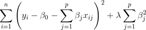

Lasso Cost Function:

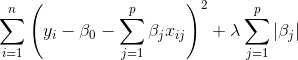

Elastic Net Cost Function:

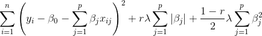

In Logistic Regression, 'l1' = lasso, 'l2' = ridge

#### Decision Trees

*A decision tree looks for variable/value combinations that can split observations in a way that decreases entropy (increases order). As the model fits, it recursively looks for the variable/value combination that most effectively maximizes **information gain**, typically defined as gini or Shannon entropy.*

```
## Information gain at any split
IG(P,C) = H(P) - weightedsums(H(C))
```

```Python
def get_information_node(yeses, nos):
    total = yeses + nos
    return - (yeses/total)*np.log2(yeses/total)- (nos/total)*np.log2(nos/total)
```

[Visual Explanation](http://www.r2d3.us/visual-intro-to-machine-learning-part-1/)

```python
## Decision Tree Visualization
import graphviz
dot_data = tree.export_graphviz(clf, out_file=None,
                         feature_names=iris.feature_names,  
                         class_names=iris.target_names,  
                         filled=True, rounded=True,  
                         special_characters=True)  
graph = graphviz.Source(dot_data)  
graph
```

#### Bagging

* **for Regression Trees** --
To apply bagging to regression
trees, we simply construct B regression trees using B bootstrapped training
sets, and average the resulting predictions. These trees are grown deep,
and are not pruned. Hence each individual tree has high variance, but
low bias. Using
B = 100 is sufficient to achieve good performance in this example.

* **for Classification Trees** -- For a given test
observation, we can record the class predicted by each of the B trees, and
take a majority vote: the overall prediction is the most commonly occurring majority class among the B predictions. Using
B = 100 is sufficient to achieve good performance in this example.

*Out of Bag Error Estimation (OOB)* -- it can be shown that in any bootstrap, an individual observation has ~ 66% chance of being chosen. This leaves approximately 1/3 of the observations "out of bag" and these can be used to cross validate.

#### Random Forest

*Random forests provide an improvement over bagged trees by way of a random
small tweak that decorrelates the trees. As in bagging, we build a number forest of decision trees on bootstrapped training samples. But when building these decision trees, each time a split in a tree is considered, a random sample of m predictors is chosen as split candidates from the full set of p predictors. The split is allowed to use only one of those m predictors.*

Ways to interpret feature impact:
* Partial Dependency Plot
* Permute a single feature
* Keep track of information gains due to each features
* Keep track of traffic that passes by each value.

#### K-Nearest Neighbors (kNN)

How to choose k?  Could start with sqrt(n)
- better way - use cross validation to find the best value

Point weighting - consider points closer more important to determining

[Plot decision boundary](http://scikit-learn.org/stable/auto_examples/neighbors/plot_classification.html#example-neighbors-plot-classification-py)

#### Support Vector Machines

*Support Vector Machines or "tricks" allow us to project data in n dimensions into higher dimension without having to compute variables in those dimensions. Simple decision boundaries in higher dimensions translate to complicated decision boundaries when translated to lower dimensions.*

* [Patrick Winston Youtube lecture](https://www.youtube.com/watch?v=_PwhiWxHK8o)

#### Unsupervised Learning

#### Dimensionality Reduction

#### PCA

*Principle Components Analysis projects many dimensions to fewer dimensions that still explain most of the variation from the many dimensions.*

**Why reduce dimensions?**
* Remove multicollinearity
* Deal with the curse of dimensionality
* Remove redundant features
* Interpretation & Visualization
* Make computations easier
* Identify Outliers

**Scree Plot**

*displays the eigenvalues associated with a component or factor in descending order versus the number of the component or factor. You can use scree plots in principal components analysis and factor analysis to visually assess which components or factors explain most of the variability in the data.*

```Python
## Scree Plot Code
def scree_plot(pca, title=None):
    num_components = pca.n_components_
    ind = np.arange(num_components)
    vals = pca.explained_variance_ratio_
    plt.figure(figsize=(10, 6), dpi=250)
    ax = plt.subplot(111)
    ax.bar(ind, vals, 0.35,
           color=[(0.949, 0.718, 0.004),
                  (0.898, 0.49, 0.016),
                  (0.863, 0, 0.188),
                  (0.694, 0, 0.345),
                  (0.486, 0.216, 0.541),
                  (0.204, 0.396, 0.667),
                  (0.035, 0.635, 0.459),
                  (0.486, 0.722, 0.329),
                 ])

    for i in range(num_components):
        ax.annotate(r"%s%%" % ((str(vals[i]*100)[:4])), (ind[i]+0.2, vals[i]), va="bottom", ha="center", fontsize=12)

    ax.set_xticklabels(ind, fontsize=12)

    ax.set_ylim(0, max(vals)+0.05)
    ax.set_xlim(0-0.45, 8+0.45)

    ax.xaxis.set_tick_params(width=0)
    ax.yaxis.set_tick_params(width=2, length=12)

    ax.set_xlabel("Principal Component", fontsize=12)
    ax.set_ylabel("Variance Explained (%)", fontsize=12)

    if title is not None:
        plt.title(title, fontsize=16)
```

```python
## Represent PCA in 2 dimensions
def plot_embedding(X, y, title=None):
    '''
    INPUT:
    X - decomposed feature matrix
    y - target labels (digits)

    Creates a pyplot object showing digits projected onto 2-dimensional
    feature space. PCA should be performed on the feature matrix before
    passing it to plot_embedding.

    '''
    x_min, x_max = np.min(X, 0), np.max(X, 0)
    X = (X - x_min) / (x_max - x_min)

    plt.figure(figsize=(10, 6), dpi=250)
    ax = plt.subplot(111)
    ax.axis('off')
    ax.patch.set_visible(False)
    for i in range(X.shape[0]):
        plt.text(X[i, 0], X[i, 1], str(y[i]),
                 color=plt.cm.Set1(y[i] / 10.),
                 fontdict={'weight': 'bold', 'size': 12})

    plt.xticks([]), plt.yticks([])
    plt.ylim([-0.1,1.1])
    plt.xlim([-0.1,1.1])

    if title is not None:
        plt.title(title, fontsize=16)
```


#### TSNE - t-distributed Stochastic Neighbor Embedding.

*t-SNE [1] is a tool to visualize high-dimensional data. It converts similarities between data points to joint probabilities and tries to minimize the Kullback-Leibler divergence between the joint probabilities of the low-dimensional embedding and the high-dimensional data. t-SNE has a cost function that is not convex, i.e. with different initializations we can get different results.*

#### K-means Clustering

Partition all observations into one of K clusters such that the total within-cluster variation, summed across all clusters, is as small as possible.

Within-cluster variation is typically defined by euclidean distance.

Hyperparameters:
* **K** - number of clusters

Steps:
1. Randomly initialize K clusters centroids
2. Repeat:
    * assign each observation to closest centroid
    * move the centroids to center of observations assigned to them

```python
## K-means class
class KMeans(object):
    '''
    K-Means clustering
    ----------
    n_clusters : int, optional, default: 3
        The number of clusters to form as well as the number of
        centroids to generate.
    init : {'random', 'random_initialization', 'k-means++'}
        Method for initialization, defaults to 'k-means++':
        'k-means++' : selects initial cluster centers for k-mean
        clustering in a smart way to speed up convergence. See section
        Notes in k_init for more details.
        'random': choose k observations (rows) at random from data for
        the initial centroids.
        If an ndarray is passed, it should be of shape (n_clusters, n_features)
        and gives the initial centers.
    n_init : int, default: 10
        Number of time the k-means algorithm will be run with different
        centroid seeds. The final results will be the best output of
        n_init consecutive runs in terms of inertia.
    max_iter : int, default: 1000
        Maximum number of iterations of the k-means algorithm for a
        single run.
    tolerance : int, default : .00001
    Attributes
    ----------
    cluster_centers_ : array, [n_clusters, n_features]
        Coordinates of cluster centers
    labels_ :
        Labels of each point
    '''

    def __init__(self, n_clusters=3, init='random', n_init=10,
                 max_iter=300, tolerance = 1e-4):

        self.n_clusters = n_clusters
        self.init = init
        self.max_iter = max_iter
        self.tolerance = tolerance
        self.n_init = n_init
        self.centroids_ = None
        self.labels_ = None

    def _initialize_centroids(self, X):
        '''
        Parameters
        ----------
        X : array-like or sparse matrix, shape=(n_samples, n_features)
            Data points to take random selection from for initial centroids
        You should code the simplest case of random selection of k centroids from data
        OPTIONAL: code up random_initialization and/or k-means++ initialization here also
        '''
        self.centroids_ = X[sample(range(len(X)),self.n_clusters)]

    def _assign_clusters(self, X):
        '''
        computes euclidean distance from each point to each centroid and
        assigns point to closest centroid)
        assigns self.labels_
        Parameters
        ----------
        X : array-like or sparse matrix, shape=(n_samples, n_features)
            Data points to assign to clusters based on distance metric
        '''
        self.labels_ = np.zeros(len(X))
        for idx_o, obs in enumerate(X):
            for idx_c, cent in enumerate(self.centroids_):
                if np.linalg.norm(obs-self.centroids_[int(self.labels_[idx_o])]) <= np.linalg.norm(obs-cent):
                    pass
                else:
                    self.labels_[idx_o] = idx_c

    def _compute_centroids(self, X):
        '''
        compute the centroids for the datapoints in X from the current values
        of self.labels_
        assigns self.centroids_
        Parameters
        ----------
        X : array-like or sparse matrix, shape=(n_samples, n_features)
            Data points to assign to clusters based on distance metric
        '''
        for idx_c, cent in enumerate(self.centroids_):
            mask = np.equal(idx_c, self.labels_)
            self.centroids_[idx_c] = np.mean(X[mask==1], axis=0)

    def fit(self, X):
        ''''
        Compute k-means clustering.
        Parameters
        ----------
        X : array-like or sparse matrix, shape=(n_samples, n_features)
            Training instances to cluster.
        '''
        self._initialize_centroids(X)
        self._assign_clusters(X)
        for i in np.arange(self.max_iter):
            self._compute_centroids(X)
            self._assign_clusters(X)

    def predict(self, X_test):
        '''
        Optional method: predict the closest cluster each sample in X belongs to.
        Parameters
        ----------
        X : {array-like, sparse matrix}, shape = [n_samples, n_features]
            New data to predict.
        Returns
        -------
        labels : array, shape [n_samples,]
            Index of the cluster each sample belongs to.
        '''
        labels = np.zeros(len(X_test))
        for idx_o, obs in enumerate(X_test):
            for idx_c, cent in enumerate(self.centroids_):
                if np.linalg.norm(obs-self.centroids_[int(labels[idx_o])]) <= np.linalg.norm(obs-cent):
                    pass
                else:
                    labels[idx_o] = idx_c
        return labels

    def score(self, X):
        '''
        return the total residual sum of squares
        Parameters
        ----------
        X : {array-like, sparse matrix}, shape = [n_samples, n_features]
            New data.
        Returns
        -------
        score : float
            The SSE
        '''
        RSS = 0
        for idx_o, obs in enumerate(X):
            RSS += (np.linalg.norm(obs-self.centroids_[int(labels[idx_o])]))**2
        return RSS
```

Methods to determine best k:
* Elbow Method
* Gap Method - like elbow method, but comparing with uniform
* Silhouette Score - (b-a) / max(a,b) where:
    * a is inter cluster distance,
    * b is next-nearest cluster centroid

**

Watchouts:
* if data are not spherical
* if a feature is noisy has more importance - may need to weight

#### K-metoids Clustering
*Like K-means, but constrained to choose a specific observation for a centroid at each step*


#### DBSCAN

*given a set of points in some space, it groups together points that are closely packed together (points with many nearby neighbors), marking as outliers points that lie alone in low-density regions (whose nearest neighbors are too far away)*

Hyperparameter:
* epsilon - max distance between points in cluster

#### Hierachical Clustering

*Bottoms of clustering. Choose one of many distance parameters, and one-by-one, begin combining clusters into like groups until there is one group. A dendrogram allows us to choose the number of clusters we wish to keep.*

$P(y|\\vec{x}) = \\frac{P(\\vec{x}|y)P(y)}{P(\\vec{x})}$

Insert image dendrogram


#### Boosting

*Boosting is a sequential algorithm in which many weak learners (high bias, low variance) are fit. In each successive iteration, a tree of depth 1 or 2 is fit to the *residuals* of the prior tree, such that the algorithm looks for features to weakly explain the errors. After many trees the model can fit many difficult decision boundaries.  The result is model that keeps its low variance, but the layering of trees results in low bias.*

[from scratch](https://www.kaggle.com/grroverpr/gradient-boosting-simplified/)

```python
## Boosting from the point of view of a single data point.
predf = 0
y_true = 5

Iter1:
predi = 3 ## from weak estimator
predf = predf + predi = 3
ei = y_true-predi = 2
yi = ei = 2

Iter2:
predi = 1 ## this is the same weak estimator, now trying to get yi
predf = predf + predi = 4
ei = y_true - predf = 1
yi = ei

...
Iter(n)
```

```python
## Plot feature importance
def feat_importance_plot(model,names,filename,color='g',alpha=0.5,fig_size=(10,10),dpi=250):
    '''
    horizontal bar plot of feature importances
    works for sklearn models that have a .feature_importances_ method (e.g. RandomForestRegressor)

    imputs
    ------
    model:    class:     a fitted sklearn model
    names:    list:      list of names for all features
    filename: string:    name of file to write, with appropriate path and extension (e.g. '../figs/feat_imp.png')

    optional imputs to control plot
    ---------------
    color(default='g'), alpha(default=0.8), fig_size(default=(10,10)), dpi(default=250)

    '''
    ft_imp = 100*model.feature_importances_ / np.sum(model.feature_importances_) # funny cause they sum to 1
    ft_imp_srt, ft_names, ft_idxs = zip(*sorted(zip(ft_imp, names, range(len(names)))))

    idx = np.arange(len(names))
    plt.figure(figsize=(10,10))
    plt.barh(idx, ft_imp_srt, align='center', color=color,alpha=alpha)
    plt.yticks(idx, ft_names)

    plt.title("Feature Importances in {}".format(model.__class__.__name__))
    plt.xlabel('Relative Importance of Feature', fontsize=14)
    plt.ylabel('Feature Name', fontsize=14)
    plt.savefig(filename,dpi=dpi)
    plt.show()
```

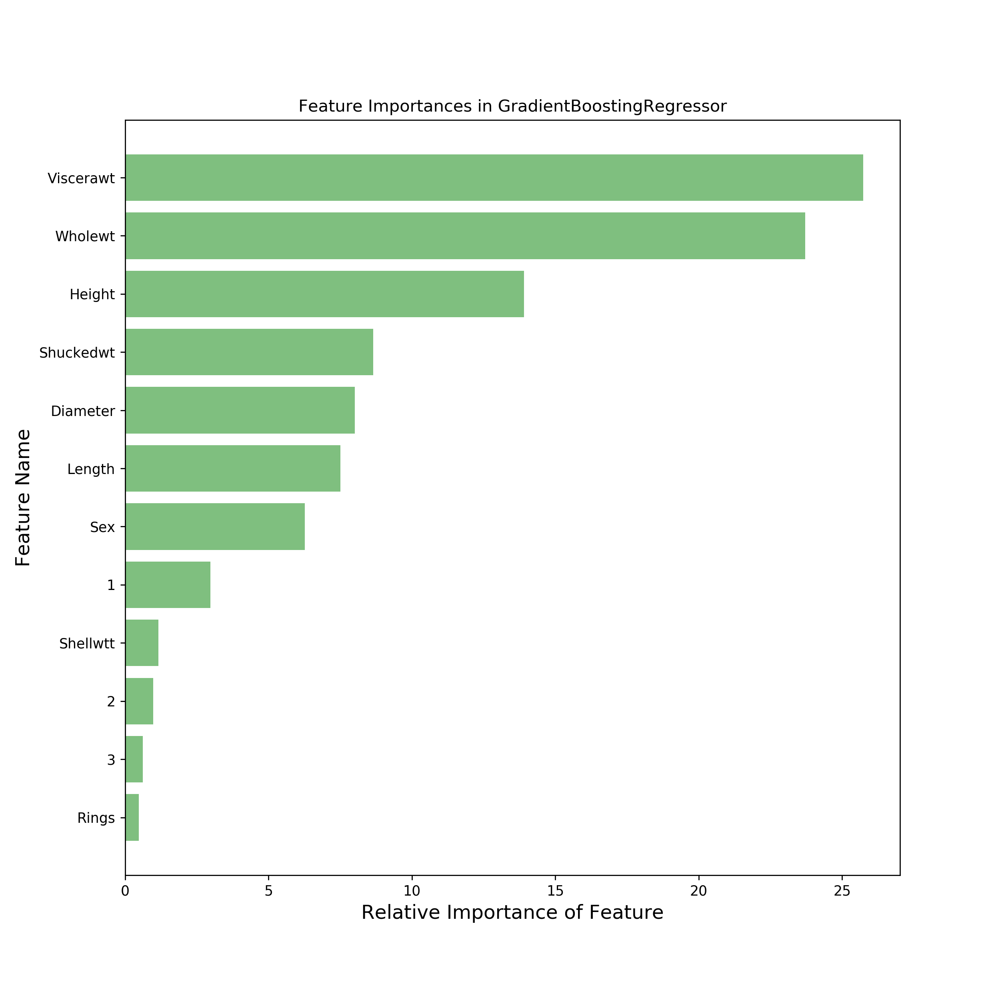

#### Partial Dependency Plots
*A graph that shows how the response variable changes as a feature changes, for all values of that feature, while holding other variables fixed*

insert image here

```python
## Plot Partial Dependency Plots
N_COLS = 3
fimportances = list(reversed(feature_importances))
fnames = list(reversed(feature_names))

pd_plots = [partial_dependence(model, target_feature, X=X_train, grid_resolution=50)
            for target_feature in feature_idxs]
pd_plots = list(reversed(zip([pdp[0][0] for pdp in pd_plots], [pdp[1][0] for pdp in pd_plots])))

fig, axes = plt.subplots(nrows=3, ncols=N_COLS, sharey=True,
                         figsize=(12.0, 8.0))

for i, (y_axis, x_axis) in enumerate(pd_plots[0:(3*N_COLS)]):
    ax = axes[i/N_COLS, i%N_COLS]
    ax.plot(x_axis, y_axis, color="purple")
    ax.set_xlim([np.min(x_axis), np.max(x_axis)])
    text_x_pos = np.min(x_axis) + 0.05*(np.max(x_axis) - np.min(x_axis))
    ax.text(text_x_pos, 8,
            "Feature Importance " + str(round(fimportances[i], )),
            fontsize=12, alpha=0.5)
    ax.set_xlabel(fnames[i])

plt.suptitle("Partial Dependence Plots (Ordered by Feature Importance)", fontsize=16)
plt.tight_layout(rect=[0, 0.03, 1, 0.95])

plt.savefig('plots/patial-dependence-plots.png', bbox_inches='tight')
```


```python
## Plot Partial dependence - 2 vars
# Two varaibles at once
fidxs = list(reversed(feature_idxs))
pdp, (x_axis, y_axis) = partial_dependence(model, (fidxs[0], fidxs[1]),
                                           X=X_train, grid_resolution=50)

fig = plt.figure()
plt.style.use('bmh')

XX, YY = np.meshgrid(x_axis, y_axis)
Z = pdp.T.reshape(XX.shape)
ax = Axes3D(fig)
ax.plot_surface(XX, YY, Z, rstride=1, cstride=1, cmap=plt.cm.BuPu)
ax.view_init(elev=30, azim=300)
ax.set_xlabel(fnames[0])
ax.set_ylabel(fnames[1])
ax.set_zlabel('Partial dependence')
ax.set_title("A Partial Dependence Plot with Two Features")
plt.savefig('plots/patial-dependence-plot-two-features.png', bbox_inches='tight')
```
#### Categorical Boosting

*Like Gradient Boost, but able to handle categoricals without get_dummies or one hot encoder*

[Effective ML Grid Search Tutorial](https://effectiveml.com/using-grid-search-to-optimise-catboost-parameters.html)

```python
categorical_features_indices = np.where(x_train_train.dtypes != np.float)[0]

modcb=CatBoostClassifier(depth=8, iterations=200, learning_rate=0.05, l2_leaf_reg=30, class_weights=class_weight,
                         use_best_model=True, one_hot_max_size=100, rsm=.5)

modcb.fit(x_train_train, y_train_train,cat_features=categorical_features_indices,eval_set=(x_train_val, y_train_val),plot=True)
```


#### SVD - Singular Value Decomposition

From an array of ratings:

Table | Book 1 | Book 2 | Book 3 | Book 4
------|----------|----------| ---| -----
Person 1| 4 | 2 | 1 | 4
Person 2 | n/a | 4 | 5 | n/a
Person 3 | 0 | 4 | 4 | 2
Person 4 | 5 | 2 | 2 | 4

"Decompose" the matrix into 3 constituent components:

[Users to topics] * [topics to topics] * [topics to books]

OR

[U] * [sigma] * [V] , where:
* U = how much each user cares about a topic
* sigma tells how important each topic is for reconstructing the original matrix, and
* V = how topics are related to books

Compared with the original matrix (the one to be decomposed), U has the same order of rows, and V keeps the same order of columns. This is useful if you're trying to keep track of which books or which users correspond to different topics.

With U * sigma, you can use cosine similarity to learn how similar users are with each other.  Similarly, with sigma * V, you can see how similar books are each otherself.

```python
# Use SVD to find topics
from numpy.linalg import svd
k = 5 # the number of topics we're looking for

# Compute SVD
U, S, VT = svd(X)

# Save in dataframes
U = pd.DataFrame(U, index=users)
VT = pd.DataFrame(VT, columns=movies)

# Keep top k topics
U = U.iloc[:,:k]
var_tot = np.sum(S**2) # total variance explained by singular values
S = S[:k] # subset S to number of topics
var_expl = [val**2/var_tot for val in S] # variance explained per topic
var_expl_tot = np.sum(var_expl) # total variance explained by the topics
S = np.diag(S)
VT = VT.iloc[:k,:]

# Reconstruct the original ratings matrix using just those topics
X_r = np.dot(U, np.dot(S, VT))
ratings_df_recon = pd.DataFrame(X_r, index=users, columns=movies)

# Calculate the error
error = X_r - X
error_df = pd.DataFrame(error, index=users, columns=movies)

# Quantify the error of the entire reconstuction using the Frobineus norm
error_Fro = np.sqrt(np.sum(error**2))

print("Using {0} topics that explain {1:0.1f}% of the variance".format(k, var_expl_tot*100))
print("\nU - Relating users to topics")
print(U.round(1))
print("\nS - Singular values: ratio of squared values explains variance")
print(S.round(1))
print("\nVT - Relating topics to movies")
print(VT.round(1))
print("\nOriginal ratings matrix")
print(ratings_df.round(1))
print("\nReconstructed ratings matrix using {0} topics".format(k))
print(ratings_df_recon.round(1))
print("\nError")
print(error_df.round(1))
print("\nError quantified using Frobineus norm, {0} topics".format(k))
print(round(error_Fro,2))
```

#### Non-negative matrix factorization

X = W * H

W [users x topics]
H [topics x movies]

As you add topics, look for the elbow in the reconstruction error.  Frobenious norm can be used for reconstruction error.

in NMF, are not orthogonal like in PCA/SVD.

```python
from sklearn.decomposition import NMF
k =  3 # number of topics

nmf = NMF(n_components = k)
nmf.fit(X)

W = nmf.transform(X)
H = nmf.components_

W = pd.DataFrame(W, index = users)
H = pd.DataFrame(H, columns = movies)

# reconstruct the matrix
X_r = np.dot(W,H)

ratings_df_recon = pd.DataFrame(X_r, index=users, columns=movies)

# Calculate the error
error = X_r - X
error_df = pd.DataFrame(error, index=users, columns=movies)

# Quantify the error of the entire reconstuction using the Frobineus norm
error_Fro = np.sqrt(np.sum(error**2))

print("Using {0} topics".format(k))
print("\nW - Relating users to topics")
print(W.round(1))
print("\nH - Relating topics to movies")
print(H.round(1))
print("\nOriginal ratings matrix")
print(ratings_df.round(1))
print("\nReconstructed ratings matrix using {0} topics".format(k))
print(ratings_df_recon.round(1))
print("\nError")
print(error_df.round(1))
print("\nError quantified using Frobineus norm, {0} topics".format(k))
print(round(error_Fro,2))
```
#### Simple Content Based Recommendation

*Use cosine similarity to determine how "close" one item is from another. Based on one item vectors, you can find the n closest vectors.*

```Python
import pandas as pd
import numpy as np
from nltk.corpus import stopwords
from nltk.tokenize import RegexpTokenizer
from nltk.stem.porter import PorterStemmer

from sklearn.feature_extraction.text import TfidfVectorizer, CountVectorizer
from sklearn.metrics.pairwise import cosine_similarity

df = pd.read_csv('data/skus_and_descriptions.csv')

def build_text_vectorizer(contents, use_tfidf=True, use_stemmer=False, max_features=None):
    '''
    Build and return a **callable** for transforming text documents to vectors,
    as well as a vocabulary to map document-vector indices to words from the
    corpus. The vectorizer will be trained from the text documents in the
    `contents` argument. If `use_tfidf` is True, then the vectorizer will use
    the Tf-Idf algorithm, otherwise a Bag-of-Words vectorizer will be used.
    The text will be tokenized by words, and each word will be stemmed iff
    `use_stemmer` is True. If `max_features` is not None, then the vocabulary
    will be limited to the `max_features` most common words in the corpus.
    '''
    Vectorizer = TfidfVectorizer if use_tfidf else CountVectorizer
    tokenizer = RegexpTokenizer(r"[\w']+")
    stem = PorterStemmer().stem if use_stemmer else (lambda x: x)
    stop_set = set(stopwords.words('english'))
    # Closure over the tokenizer et al.
    def tokenize(text):
        tokens = tokenizer.tokenize(text)
        stems = [stem(token) for token in tokens if token not in stop_set]
        return stems
    vectorizer_model = Vectorizer(tokenizer=tokenize, max_features=max_features)
    vectorizer_model.fit(contents)
    vocabulary = np.array(vectorizer_model.get_feature_names())
    # Closure over the vectorizer_model's transform method.
    def vectorizer(X):
        return vectorizer_model.transform(X).toarray()
    return vectorizer, vocabulary

vect_X = vect(df['description'])

similar = cosine_similarity(vect_X)

def recommender():
    id = int(input('Choose an ID: '))
    id = id-1
    order = similar[id,:].argsort()
    top_five = np.array(df)[order][-6:-1]
    print('Your selection is: {} \n'.format(df['description'].iloc[id]))
    for num in np.arange(5):
        print('Recommendation: {} \n'.format(top_five[num,1]))
```

#### Natural Language Processing (NLP)

*In class we used Naive Bayes to determine whether a document belonged to one of many classes. P(type|words) = P(words|type) x P(type)/P(words).  All of the values on the right hand side of the equation can be trained using historical data.*

[Natural Language Toolkit NLTK](http://www.nltk.org/)

```python
## Tokenize words
def tokenize(text):
    regex = re.compile('<.+?>|[^a-zA-Z]')
    clean_txt = regex.sub(' ', text)
    tokens = clean_txt.split()
    lowercased = [t.lower() for t in tokens]

    no_punctuation = []
    for word in lowercased:
        punct_removed = ''.join([letter for letter in word if not letter in PUNCTUATION])
        no_punctuation.append(punct_removed)
    no_stopwords = [w for w in no_punctuation if not w in STOPWORDS]

    STEMMER = PorterStemmer()
    stemmed = [STEMMER.stem(w) for w in no_stopwords]
    return [w for w in stemmed if w]
```

#### Latent Dirichlet Allocation LDA

#### Term Frequency - Inverse Document Frequency (TD_IDF)

#### Expectation-Maximization Algorithm (EM algorithm)

Taught through Gaussian Mixture Models (GMM)

[Andrew Ngs Paper on EM](http://cs229.stanford.edu/notes/cs229-notes8.pdf)


*You have data that does not appear to come from any one distribution, but think it may be a mixture of distributions, but you don't know the parameters. You can guess the parameters, and then use maximum likelihood to converge toward what the actual parameters are.*

```python
"""
This is an implementation of two-component Gaussian Mixture Model from
Elements of Statistical Learning (pp 272)
"""

## make imports
from __future__ import division
import sys
import numpy as np
import matplotlib.mlab as mlab
import matplotlib.pyplot as plt
import scipy.stats as stats

class TwoComponentGaussian():

    def __init__(self, y, num_iters=25, num_runs=20, verbose=False):
        """
        constructor
        """
        self.y = y
        self.verbose = verbose
        self.num_runs = num_runs
        self.num_iters = num_iters
        self.params = self._guess_initial_parameters()
        self.gaussian1 = None
        self.gaussian2 = None
        self.log_likelihood = None
        self.gamma_hat = np.zeros((self.params['n']), 'float') ## allocate memory for the responsibilities

    def _guess_initial_parameters(self):
        """
        make intial random guesses for the parameters
        """
        n    = len(self.y)
        mu1  = self.y[np.random.randint(0,n)]
        mu2  = self.y[np.random.randint(0,n)]
        var1 = np.random.uniform(0.5,1.5)
        var2 = np.random.uniform(0.5,1.5)
        pi   = 0.5
        return {'n':n, 'mu1':mu1, 'mu2':mu2, 'var1':var1, 'var2':var2, 'pi':pi}

    def _update_gaussian_distributions(self):
        self.gaussian1 = stats.norm(
            loc=self.params['mu1'],
            scale=np.sqrt(self.params['var1'])
            )
        self.gaussian2 = stats.norm(
            loc=self.params['mu2'],
            scale=np.sqrt(self.params['var2'])
            )

    def _update_expectation(self):
        """
        expectation step
        ARGS
        self.y: expectation is performed with respect to these data
        self.params: the most recent dictionary of parameters
        OUTPUT
        self.gamma_hat: the responsibilities
        """
        ## use the normal pdf to calculate the responsibilities
        self._update_gaussian_distributions()
        gamma_hat = (
        (self.params['pi'] * self.gaussian2.pdf(self.y)) / (
            ((1 - self.params['pi']) * self.gaussian1.pdf(self.y)) +
            (self.params['pi'] * self.gaussian2.pdf(self.y))
            )
        )
        self.gamma_hat = gamma_hat

    def _update_parameters(self):
        """
        maximization step
        ARGS
        params: the dictionary of parameters
        self.y: the data we are looking to maximize over
        self.gamma_hat: the most recently estimated responsibilities
        OUTPUT
        params: an updated dictionary of the parameters
        """
        mu_hat1 = np.sum((1-self.gamma_hat) * self.y) / np.sum(1-self.gamma_hat)
        mu_hat2 = np.sum(self.gamma_hat * self.y) / np.sum(self.gamma_hat)
        var_hat1 = np.sum((1 - self.gamma_hat) * (self.y - mu_hat1)**2) / np.sum(1 - self.gamma_hat)
        var_hat2 = np.sum(self.gamma_hat * (self.y - mu_hat2)**2) / np.sum(self.gamma_hat)
        pi_hat = np.sum(self.gamma_hat) / len(self.gamma_hat)
        self.params.update(
        {'mu1': mu_hat1, 'mu2':mu_hat2, 'var1': var_hat1, 'var2': var_hat2, 'pi': pi_hat}
        )

    def _update_log_likelihood(self):
        """
        likelihood
        returns a single value
        the likelihood function has two parts and the output is a sum of the two parts
        """
        ## using the normal pdf calculate the responsibilities
        self._update_gaussian_distributions()
        part1 = np.sum(
        (1 - self.gamma_hat) * np.log(self.gaussian1.pdf(self.y)) +
        (self.gamma_hat * np.log(self.gaussian2.pdf(self.y)))
        )
        part2 = np.sum(
        (1 - self.gamma_hat) * np.log(1 - self.params['pi']) +
        (self.gamma_hat * np.log(self.params['pi']))
        )
        self.log_likelihood = part1 + part2

    def run_em_algorithm(self, verbose=True):
        """
        main algorithm
        """

        maximum_likelihood = -np.inf
        best_estimates = None

        ## loop through the total number of runs
        for j in range(self.num_runs):
            iter_count = 0

            ## iterate between E-step and M-step
            while iter_count < self.num_iters:
                iter_count += 1

                ## ensure we have reasonable estimates
                if (self.params['var1'] < 0.0) or (self.params['var2'] < 0.0):
                    iter_count = 1
                    self._guess_initial_parameters()

                ## E-step
                self._update_expectation()
                self._update_log_likelihood()

                ## M-step
                self._update_parameters()

            if self.log_likelihood > maximum_likelihood:
                maximum_likelihood = self.log_likelihood.copy()
                best_estimates = self.params.copy()

            if self.verbose == True:
                print('run: {run} iteration {iter} --- mu1: {mu1} --- mu2: {mu2} \
                --- observed data likelihood: {likelihood}'.format(
                    run=j+1,
                    iter=iter_count,
                    mu1=round(self.params['mu1'],2),
                    mu2=round(self.params['mu2'],2),
                    likelihood=round(self.log_likelihood,4)
                    )
                )

        print("{n} runs with {m} iterations each, complete".format(
        n=self.num_runs, m=self.num_iters)
        )
        print('maximum likelihood: {}'.format(maximum_likelihood))
        print('best parameter estimates: {}'.format(best_estimates))
        self.plot_mixture_model(iteration=iter_count)
        return maximum_likelihood, best_estimates

    def plot_mixture_model(self, iteration):
        fig = plt.figure(figsize=(8,6))
        ax = fig.add_subplot(111)
        x = self.y.copy()
        ax.hist(x, bins=25, density=True, alpha=0.6, fc='lightblue', histtype='stepfilled')
        xmin, xmax = ax.get_xlim()
        pdf_range = np.linspace(xmin, xmax, x.size)
        ax.plot(pdf_range, self.gaussian1.pdf(pdf_range),'darkblue', alpha=iteration/self.num_iters, label='pdf')
        ax.plot(pdf_range, self.gaussian2.pdf(pdf_range),'darkblue', alpha=iteration/self.num_iters, label='pdf')
        ax.set_xlabel("wait times (minutes)")
        plt.show()
```

#### Neural Networks

*A neural net has 2 or more layers, with the number of features in the first layer, and the number of classes to predict in the last layer.  A network is fit by randomly initializing weights that connect each neuron in one layer to each neuron in the next.  One by one, observations are passed through these weights, make a prediction, find an error, and then tune each weight (through back prop).  After doing this for each observations, weve completed one epoch.*

[tensorflow playground](https://playground.tensorflow.org)

#### Autoencoders

*Use a NN to map info to fewer dimensions*

* Common uses:
    * Reduction in dimensionality of data before sending to another algorithm
    * Denoising (noise added to input, output is input without noise) & * Recently, generative (learns parameters of distributions)

Word2Vec maps

#### Image Processing

*Can classify images like cats and dogs, tumors or not, and so on.*

use scikit-image (Skimage)
has an rgb to gray method

Different kinds of colors - RGB, HSV (hue saturation )

#### Convolutional Networks

*A way to process images, leaving the original image intact (not raveling into a vector). In general, the pattern is to do a convolutional layer, then an activation layer, then a pooling (or subsampling) filter.*

#### Recurrent Neural Networks (RNN)

Good for time series, useful for carrying information forward through time.

Watchout - exploding gradient

[Karpathy Blog](http://karpathy.github.io/2015/05/21/rnn-effectiveness/)
[Time Series Blog](http://www.jakob-aungiers.com/articles/a/LSTM-Neural-Network-for-Time-Series-Prediction)

#### Long Short Term Memory Networks (LSTM)

*Special kind of RNN. Improves upon RNN deficiency of not remembering information from very far back (in time).*

[Colahs Blog comparing LSTM to RNN](http://colah.github.io/posts/2015-08-Understanding-LSTMs/)

The **cell state** is an important concept.  It transfers information from prior time period through to future time periods.  In each time period it picks up new information that is relevant for the future, but in a carefully regulated way (by a sigmoid layer)


#### Seq to Seq

github.com/google/seq2seq

#### Sampling Density, Curse of dimensionality

*As features are added to a model "density" decreases. Low density data sets create problems for many algorithms, so it is desirable to get more data to keep data density high.*

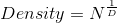

Where:
* N = number of data points
* D = number of dimensions/features


#### Model Stacking

*Use the predictions from "level-one" estimators as input variables for a level-two estimator. The level-two estimator can learn where the level-one estimators were strong and thus improve predictions.*

Steps

1. Use the wrapper (below) to house sklearn alogirthm
2. Save the parameters of level-one algorithms ahead of time (see below)
3. Create the model instances
4. Get leve-one predicitions and add to the data set with concatenate. Remember, you need both predictions for test and train.
5. Fit the level-2 classifier with original AND new columns from the level one predictors.


```python
# Some useful parameters which will come in handy later on
ntrain = train.shape[0]
ntest = test.shape[0]
SEED = 0 # for reproducibility
NFOLDS = 5 # set folds for out-of-fold prediction
kf = KFold(ntrain, n_folds= NFOLDS, random_state=SEED)

# Class to extend the Sklearn classifier
class SklearnHelper(object):
    def __init__(self, clf, seed=0, params=None):
        params['random_state'] = seed
        self.clf = clf(**params)

    def train(self, x_train, y_train):
        self.clf.fit(x_train, y_train)

    def predict(self, x):
        return self.clf.predict(x)

    def fit(self,x,y):
        return self.clf.fit(x,y)

    def feature_importances(self,x,y):
        print(self.clf.fit(x,y).feature_importances_)

def get_oof(clf, x_train, y_train, x_test):
    oof_train = np.zeros((ntrain,))
    oof_test = np.zeros((ntest,))
    oof_test_skf = np.empty((NFOLDS, ntest))

    for i, (train_index, test_index) in enumerate(kf):
        x_tr = x_train[train_index]
        y_tr = y_train[train_index]
        x_te = x_train[test_index]

        clf.train(x_tr, y_tr)

        oof_train[test_index] = clf.predict(x_te)
        oof_test_skf[i, :] = clf.predict(x_test)

    oof_test[:] = oof_test_skf.mean(axis=0)
    return oof_train.reshape(-1, 1), oof_test.reshape(-1, 1)
```
```python
# save parameters of models ahead of time (for example)
rf_params = {
    'n_jobs': -1,
    'n_estimators': 500,
     'warm_start': True,
     #'max_features': 0.2,
    'max_depth': 6,
    'min_samples_leaf': 2,
    'max_features' : 'sqrt',
    'verbose': 0
}
```

```python
## Create the model instances
rf = SklearnHelper(clf=RandomForestClassifier, seed=SEED, params=rf_params)
et = SklearnHelper(clf=ExtraTreesClassifier, seed=SEED, params=et_params)
ada = SklearnHelper(clf=AdaBoostClassifier, seed=SEED, params=ada_params)
gb = SklearnHelper(clf=GradientBoostingClassifier, seed=SEED, params=gb_params)
svc = SklearnHelper(clf=SVC, seed=SEED, params=svc_params)
```

```python
# Create our OOF train and test predictions. These base results will be used as new features
et_oof_train, et_oof_test = get_oof(et, x_train, y_train, x_test) # Extra Trees
rf_oof_train, rf_oof_test = get_oof(rf,x_train, y_train, x_test) # Random Forest
ada_oof_train, ada_oof_test = get_oof(ada, x_train, y_train, x_test) # AdaBoost
gb_oof_train, gb_oof_test = get_oof(gb,x_train, y_train, x_test) # Gradient Boost
svc_oof_train, svc_oof_test = get_oof(svc,x_train, y_train, x_test) # Support Vector Classifier

print("Training is complete")

x_train = np.concatenate(( et_oof_train, rf_oof_train, ada_oof_train, gb_oof_train, svc_oof_train), axis=1)
x_test = np.concatenate(( et_oof_test, rf_oof_test, ada_oof_test, gb_oof_test, svc_oof_test), axis=1)
```


___

# Model Selection and Evaluation

*We need ways to compare candidate models to determine which, under varying circumstances, is the best.*

**Total Sum of Squares (TSS):** the total possible variation in y - this is what we're trying to explain.


**Residual Sum of Squares (RSS):** take each error term and square it, add them up. Boom.

**R-squared:** is a measure of the linear relationship between X and Y.

**Residual Standard Error:** An estimate of the standard deviation of errors, or the average aount aount that the resonse will deviate from the true regression line.

**F-statistic:** Hypothesis that at least one coefficient is non-zero.

#### Cross validation

*A way to ensure that a model generalizes to new data, cross validations attempts to fit data a model to "new" data, prior to seeing how well it performs on test data.  Typically, a dataset will be split into a test set and a training set, and the training set will then be divided further into training and validation sets. A popular way to validate is with "k-folds", splitting the training set into k folds, then computing how a model fits on the kth fold with training on the !k (not kth) folds.*

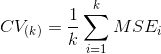

#### K-folds Cross-Validation

*Takes a training set of data and breaks it into 5 folds.  Through 5 iterations, fits a linear model on the *other* folds, then scores how will the model fits on the fold at hand `foldrmse = rmse(y_test_f, test_f_predicted)`. Collects these scores and returns them.*

```python
def crossVal(X_train, y_train):
    kf = KFold(n_splits=5)
    RMSES = []
    for train_index, test_index in kf.split(X_train):
        X_train_f, X_test_f = X_train[train_index], X_train[test_index]
        y_train_f, y_test_f = y_train[train_index], y_train[test_index]
        linear = LinearRegression()
        linear.fit(X_train_f, y_train_f)
        test_f_predicted = linear.predict(X_test_f)
        foldrmse = rmse(y_test_f, test_f_predicted)
        RMSES.append(float(foldrmse))
    print('The rsme of each fold is {}'.format(RMSES))
    print('The average rmse of each fold is {}'.format(np.mean(RMSES)))
```


#### Recursive Feature Elimination (RFE)   
*At each iteration, select one feature to remove until there are n feature left*

```python
## Recursive Feature Elimination
from sklearn.feature_selection import RFE
linear_fri = LinearRegression()
selector.fit(X_fri, y_fri)
def gen_modselect_score(n):
    scores = []
    for i in np.arange(n):
        selector = RFE(linear_fri, (21-i), step=1)
        selector.fit(X_fri, y_fri)
        scores.append(selector.score(X_fri, y_fri))
    return scores
```

#### SelectKBest [.](http://scikit-learn.org/stable/modules/generated/sklearn.feature_selection.SelectKBest.html)

*The SelectKBest class just scores the features using a function and then removes all but the k highest scoring features.*

```python
## Dropping Variables
from sklearn.feature_selection import SelectKBest
best_3_selector = SelectKBest(chi2, k=3)
best_3_selector.fit(X_wells, y_wells)
```

#### Variance Threshold [.](http://scikit-learn.org/stable/modules/generated/sklearn.feature_selection.VarianceThreshold.html)

*Drop all features that dont meet a variance threshold*

```python
from sklearn.feature_selection import VarianceThreshold
X = [[0, 2, 0, 3], [0, 1, 4, 3], [0, 1, 1, 3]]
selector = VarianceThreshold()
selector.fit_transform(X)


#### ROC Curve
*Plots False Negative Rate (x-axis) vs. True Positive Rate (y-axis) for various thresholds we set for predicted probabilities. It helps us choose the appropriate threshold for achieving the best precision or recall - use accuracy or precision to determine how good the model actually is.*

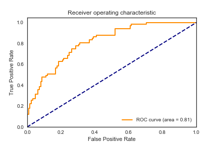

```python
## ROC Curve
from sklearn.metrics import roc_curve, auc
TPR, FPR, thresholds = roc_curve(y_test, y_test_preds, pos_label=None, sample_weight=None, drop_intermediate=True)

def plotroc(TPR, FPR):
    roc_auc = auc(TPR, FPR)
    plt.figure()
    lw = 2
    plt.plot(TPR, FPR, color='darkorange',
             lw=lw, label="ROC curve area = {0:0.4f}".format(roc_auc))
    plt.plot([0, 1], [0, 1], color='navy', lw=lw, linestyle='--')
    plt.xlim([0.0, 1.0])
    plt.ylim([0.0, 1.05])
    plt.xlabel('False Positive Rate')
    plt.ylabel('True Positive Rate')
    plt.title('Receiver operating characteristic example')
    plt.legend(loc="lower right")
    plt.show()
```

#### Profit Curve

*Assigns costs to tp, fp, etc., and calculates profits for various thresholds to help a business choose the best model.*

```python
def profit_curve(cost_benefit_mat, y_pred_proba, y_true):
    """Function to calculate list of profits based on supplied cost-benefit
    matrix and prediced probabilities of data points and thier true labels.

    Parameters
    ----------
    cost_benefit    : ndarray - 2D, with profit values corresponding to:
                                          -----------
                                          | TP | FP |
                                          -----------
                                          | FN | TN |
                                          -----------
    predicted_probs : ndarray - 1D, predicted probability for each datapoint
                                    in labels, in range [0, 1]
    labels          : ndarray - 1D, true label of datapoints, 0 or 1

    Returns
    -------
    profits    : ndarray - 1D
    thresholds : ndarray - 1D
    """
    n_obs = float(len(y_true))
    # Make sure that 1 is going to be one of our thresholds
    maybe_one = [] if 1 in y_pred_proba else [1]
    thresholds = maybe_one + sorted(y_pred_proba, reverse=True)
    profits = []
    for threshold in thresholds:
        y_predict = y_pred_proba >= threshold
        confusion_matrix = standard_confusion_matrix(y_true, y_predict)
        threshold_profit = np.sum(confusion_matrix * cost_benefit) / n_obs
        profits.append(threshold_profit)
    return np.array(profits), np.array(thresholds)
```

#### AIC & BIC


*If two models have similar predictive power, we tend to prefer the one with fewer features. The simpler model focuses our attention to features that matter, is easier to replicate, is easier to put into production, and so on. Therefore, it would be nice to have model evaluators that account for the number of feature included.  This is the Akaike information criterion (AIC).*

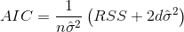


#### Grid Search
*Models typically have hyperparameters and arguments that can be searched over to find the optimal model.  Grid Search takes a model a looks over a grid of many parameters to to find the optimal model.*

*Pro tip* - Start with a coarse grid, then do a fine grid
```Python
## Grid Search Code
from sklearn.model_selection import GridSearchCV
random_forest_grid = {’max_depth’: [3, None],
                      ’max_features’: [’sqrt’, ’log2’, None],
                      ’min_samples_split’: [1, 2, 4],
                      ’min_samples_leaf’: [1, 2, 4],
                      ’bootstrap’: [True, False],
                      ’n_estimators’: [20, 40, 60, 80, 100, 120],
                      ’random_state’: [42]}
rf_gridsearch = GridSearchCV(RandomForestClassifier(),
                      random_forest_grid,
                      n_jobs=-1,verbose=True,
                      scoring=’f1_weighted’)
rf_gridsearch.fit(X_train, y_train)
print("best parameters:", rf_gridsearch.best_params_)
```


___
# Visualization

* [flowingdata](http://flowingdata.com/)

#### matplotlibx

* Plot in style xkcd: add  `plt.xkcd()` in header
* Plot "fivethirtyeight: `plt.style.use('fivethirtyeight')`
* [Gallery](https://matplotlib.org/gallery.html)
* [Pyplot examples (scroll down)](https://matplotlib.org/gallery/index.html#pyplots-examples)
* restore defaults `plt.rcdefaults()`

```python
fig, axes = plt.subplots(3,3, figsize=(10,10))
col_names = ['age', 'sex', 'bmi', 'bp', 's1', 's2', 's3', 's4', 's5', 's6']

for m, ax in zip(col_names, axes.flatten()):
    ax.scatter(Xpd[m], ypd)
    ax.set_title(m)
```


```python
## Violin Plot -
## see difference in continous var across levels of categorical variable
def violin_plot_binary(categorical_var, continuous_var, df):
    # Draw a nested violinplot and split the violins for easier comparison
    sns.violinplot(x=categorical_var, y=continuous_var, data=df, split=True,
                   inner="quart")
    sns.despine(left=True)
```

```python
## Plotting Two Histograms with Alpha = 0.5
figpois = plt.figure(figsize=(12,6))
acax = figpois.add_subplot(111)
acax.set_title('Histogram, Accidents in a Month')
acax.hist(count_by_month, bins = 15, alpha = 0.5, density=1, label='Actual')
acax.hist(randpois, bins = 57, alpha = 0.5, color='g', density=1, label='Poisson')
acax.set_ylabel('Frequency')
acax.legend();
```


```Python
## Two variables, plotting y's
fig1 = plt.figure(figsize=(12,10))
ax1 = fig.add_subplot(111)
ax1.scatter(X_dogs[:,0], X_dogs[:,1], color='b', label='dogs')
ax1.scatter(X_horses[:,0], X_horses[:,1], color='r', label='horses')
ax1.legend(shadow=True, fontsize='xx-large')
ax1.set_xlabel('Weight (lb)',fontsize=font_size)
ax1.set_ylabel('Height (in)',fontsize=font_size)
ax1.set_title('Horse or dog?',fontsize=font_size)
plt.show()
```

```python
## 3D Plotting
from mpl_toolkits.mplot3d import Axes3D
fig = plt.figure(figsize=(12,10))
ax = fig.add_subplot(111, projection='3d')
ax.scatter(df[:,1], df[:,3], df[:,0], c=y,s=35)
ax.set_xlabel('Dim1',fontsize=20,labelpad=25.0)
ax.set_ylabel('Dim0',fontsize=20,labelpad=25.0)
ax.set_zlabel('Dim3',fontsize=20,labelpad=25.0)
plt.tight_layout()
plt.show()
```

```python
## Plot Corr heat map
sns.set(style="white")
# Compute the correlation matrix
corr = train_train.corr()
# Generate a mask for the upper triangle
mask = np.zeros_like(corr, dtype=np.bool)
mask[np.triu_indices_from(mask)] = True
# Set up the matplotlib figure
f, ax = plt.subplots(figsize=(11, 9))
# Generate a custom diverging colormap
cmap = sns.diverging_palette(220, 10, as_cmap=True)
# Draw the heatmap with the mask and correct aspect ratio
sns_plot = sns.heatmap(corr, mask=mask, cmap=cmap, vmax=.3, center=0,
            square=True, linewidths=.5, cbar_kws={"shrink": .5})
```


#### GGPlot

* [Cheat sheet](https://www.rstudio.com/wp-content/uploads/2015/03/ggplot2-cheatsheet.pdf)

#### Seaborn

* [Gallery](https://seaborn.pydata.org/examples/index.html)
___
# Data Products

#### Markdown

Adding a math equations:
* [Go to CodeCogs](http://latex.codecogs.com/eqneditor/editor.php)
* Write your math equation
* Change dpi to 300 and set background to white
* download as png and save to images folder
* use pipe code to reference in markdown.


* [Markdown Cheatsheet](https://github.com/adam-p/markdown-here/wiki/Markdown-Here-Cheatsheet)
* [Math Symbols](https://reu.dimacs.rutgers.edu/Symbols.pdf)
* [Markdown Table Generator](http://www.tablesgenerator.com/markdown_tables)

#### Flask

#### Talking to Business People

* Describe stuff they already know  
* Add on easy to explain statistical analysis  
* Demonstrate how the historical analysis can be cast to the future
* Identify actions to take based on that forecast

---
#### Top Things To Study

* Clean project code
* Docker
* Spark
  * Spark Streaming
* NLP, TD-IDF
* Neural Nets
  * Watch Andrew Ng Neural Nets
  * Understand softmax activation
* Probabilistic Programming - other models
* PCA, T-SNE
* Study maximum a posteriori (MAP)
* Python
  * Objects and classes
* [Udemy recommendation from Chris](https://www.udemy.com/machine-learning-fun-and-easy-using-python-and-keras/)
* Study SMOTE & undersampling
* Study pyomo
* Collaborative Filtering
  * Study Frobenious Norm - came up in SVD and NMF
* Clustering algorithm - types of patients based on referrals data
* Outlier detection -
* Naive Bayes
* Distributions and Conjugate Priors
* Pipelines (Chris's Thing)

#### Resources Not Covered In Depth

* Model selection 4_machine_learning/glms - notebook
* http://www.dataschool.io/15-hours-of-expert-machine-learning-videos/

#### Future Project List list
* Referrals Utilization - changepoint analysis
  - can we detect when a doctor begins referring more or less?
  - compare PCPs vs PCPs, specialists vs specialists
  - Pros - different from bayes
  - Cons - need to age sex adjust Referrals
* Admissions forecasting
  - somewhat boring, I'm sure I can do this, but not sure what we'll changes
  - could "prove" efficacy of incumbent model
* Medical Expense forecaster
  - Pros - high profile
  - Cons - Finance and actuaries already working on this
* Predict Member Churn
  - Pros - largely untouched, would be useful
  - Cons - not sure if data will be predictive
* NLP - classify notes in electronic health record - "read notes and classify one of several. lacking a diagnosis. completeness of note."

___
#### Style Guide


# <span style="color:grey">Major Header</span>
#### Any other header
*Explanation of what that header is in your own words*


* Resource 1
* Resource 2

```python
## Title of code snippet
-- CODE HERE --
```
